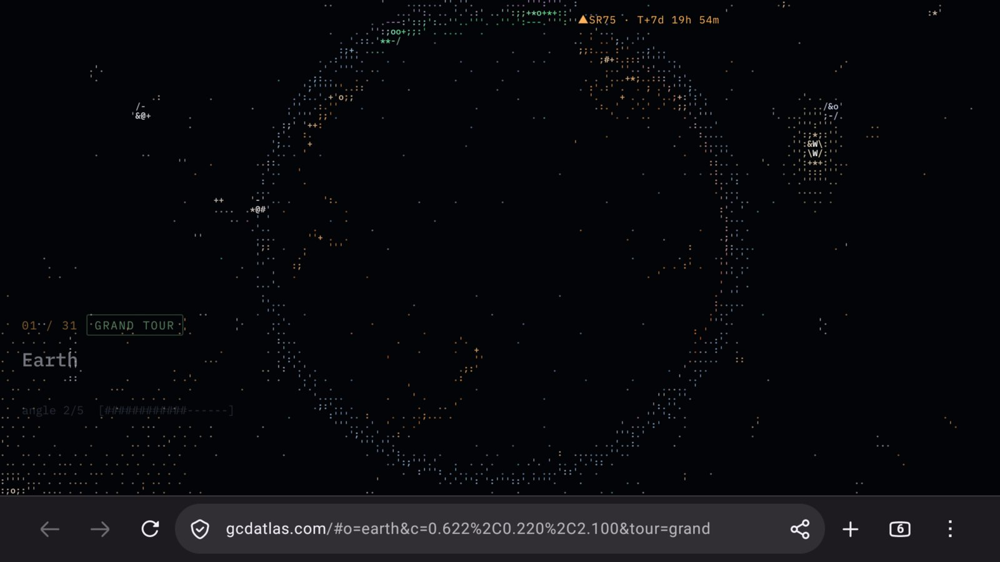
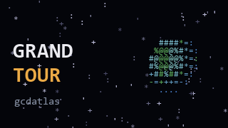

# android-tv-site-launcher

Put any website on your Android TV home screen as its own button, and make sure it runs well once it opens.



This repo contains two things:

1. **A guide** that starts from a stock Android TV box: turn on debugging, connect from a PC, and install and update apps from the command line.
2. **A small Android TV app** (about 80 lines of Java). Press it on the home screen and it shows one web page full screen: no browser bar, no tabs, and the page's sound can start without a click. It embeds GeckoView, Firefox's engine as a library. The version here opens [gcdatlas](https://gcdatlas.com), an ASCII-art atlas of the universe, straight into its 31-stop grand tour. Edit two lines to point it at your own site.



Tested on an NVIDIA Shield TV Pro (2019, Android 11) in September 2026.

## Steps

| Step | Guide |
|---|---|
| 1. Turn on developer options and network debugging, then connect with `adb` | [docs/enable-adb-debugging.md](docs/enable-adb-debugging.md) |
| 2. Test your site in the browsers you have, and keep them current (why the app uses Firefox's engine) | [docs/pick-and-update-the-browser.md](docs/pick-and-update-the-browser.md) |
| 3. Build the button app and install it | [below](#build-and-install-the-button) |
| What went wrong along the way, and why | [docs/lessons.md](docs/lessons.md) |

## Build and install the button

Needs the Android SDK and JDK 17 or newer (Android Studio ships both). The first build downloads GeckoView from maven.mozilla.org. The APK is about 200 MB because it carries the whole engine; it's built for arm64 TVs only (the Shield, most Google TV boxes) and needs Android 8.0 or newer.

1. Open `app/build.gradle.kts` and set the two values at the top:
   - `launchUrl`: the page to open.
   - `buttonLabel`: the name shown under the button.
2. Optional: replace `app/src/main/res/drawable/banner.png` with your own 320 x 180 image. Android TV shows this banner on the home screen.
3. Build it. On Windows run `gradlew.bat assembleDebug`. On macOS or Linux, run `gradle wrapper` once to create `./gradlew`, then run `./gradlew assembleDebug`. You can also just open the folder in Android Studio.
4. Install it on the TV, with `<tv-ip>` replaced by your TV's address (step 1 shows how to find it):

   ```bash
   adb -s <tv-ip>:5555 install -r app/build/outputs/apk/debug/app-debug.apk
   ```

5. The button appears in the TV's app list. Long-press it to move it into your favorites row.

Press Back or Home to leave. The app closes the page as it goes, so nothing keeps playing in the background, and the next press starts fresh.

## Useful gcdatlas links

These are read from the page's own URL parser:

- `#o=earth&tour=grand` starts the grand tour at Earth.
- `?flags=-live,-planes,-launches` switches off the live satellite, aircraft and launch overlays for that visit. These parameters go before the `#`.
- In the page, **G** toggles glow and **V** changes the detail level.

## License

MIT. gcdatlas itself belongs to its author. This repo only opens it.
